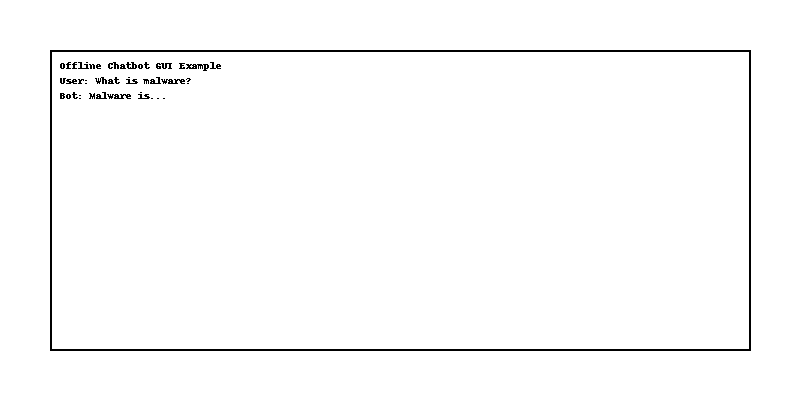

# Offline Chatbot with GUI

This is a simple offline chatbot built using Python, `transformers` (Hugging Face), and `tkinter` for GUI.

### Features:
- Runs locally with no API key required
- Uses GPT-2 model to generate responses
- Simple and intuitive GUI

### How to Run:
1. Install dependencies:
```
pip install transformers
```

2. Run the GUI script:
```
python gui_chatbot.py
```

### Demo Screenshot:

